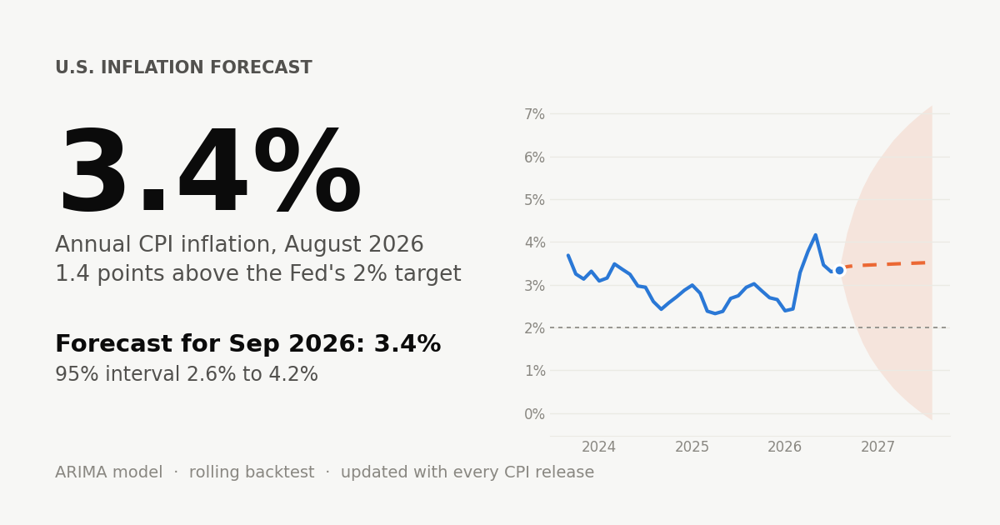
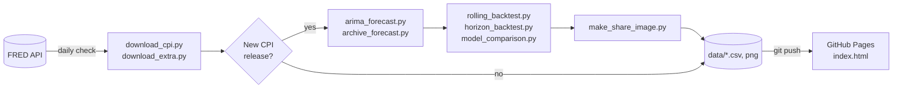

# U.S. Inflation Forecast

[](https://github.com/ppc1004/ai-inflation-forecast/actions/workflows/update-data.yml)
[](https://github.com/ppc1004/ai-inflation-forecast/actions/workflows/tests.yml)

A self-updating dashboard that tracks U.S. CPI inflation, forecasts it 12 months ahead with an ARIMA model, and publishes the model's track record: backtests, accuracy by horizon, interval calibration and a live archive of every forecast it has made.

**Live site: [ppc1004.github.io/ai-inflation-forecast](https://ppc1004.github.io/ai-inflation-forecast/)**



## What's on the site

| Section | Contents |
|---|---|
| **Overview / Forecast** | Latest YoY and MoM inflation, 12-month forecast with 95% intervals, monthly forecast table |
| **Track record** | Rolling one-month-ahead backtest vs a naive benchmark, error over time, model comparison, accuracy for 1–12 month horizons, interval coverage, live forecast archive |
| **What's driving it** | Core, food, energy and shelter inflation |
| **Everyday prices** | BLS average prices for eggs, gasoline, milk, coffee and bread |
| **History** | Inflation since 1948 with major episodes annotated |
| **Your money** | Purchasing-power calculator, wage growth vs inflation |
| **Expectations** | Model vs consumer survey (U. Michigan) vs market breakeven inflation |
| **Fed & rates** | Federal funds rate vs inflation and the real policy rate |

## How it works



A GitHub Actions job runs every day. It always refreshes the supporting series, and re-runs the models only when BLS has published a new CPI figure (or when the workflow is started by hand). The website is a single dependency-free HTML file that reads the CSVs and draws every chart as inline SVG.

## Method

- **Data.** CPI-U, all items, seasonally adjusted (`CPIAUCSL`). Inflation is the 12-month percent change. BLS did not publish October 2025 CPI because of the federal government shutdown; that month is filled by linear interpolation so every year-over-year rate compares the same calendar month (`src/data_utils.py`).
- **Model.** ARIMA(1, 0, 2) on year-over-year inflation, chosen from nine candidate orders by out-of-sample error rather than in-sample fit.
- **Evaluation.**
  - *Rolling-origin backtest*: over the last 24 months the model is re-fit on data available at the time and forecasts one month ahead, compared with a naive "no change" benchmark (MAE, RMSE, per-month errors).
  - *Horizon backtest*: 48 forecast origins, each scored at 1–12 months ahead, with the share of outcomes that fell inside the 95% interval.
  - *Live archive*: each published forecast is stored with its data vintage and scored when the actual CPI print arrives.
- **Limitations.** A univariate model sees only past inflation, not energy prices, wages or policy, and tends to lag turning points.

## Repository layout

```
src/
  data_utils.py          shared CPI loading and YoY calculation
  download_cpi.py        headline CPI from FRED
  download_extra.py      components, average prices, wages, rates, expectations
  arima_forecast.py      12-month forecast
  archive_forecast.py    permanent record of every forecast
  rolling_backtest.py    one-step-ahead backtest vs naive
  horizon_backtest.py    1–12 month accuracy and interval coverage
  model_comparison.py    hold-out comparison of ARIMA orders
  make_share_image.py    social preview card
data/                    generated CSVs and the preview image
tests/                   pytest suite (no network access needed)
index.html               the website
```

## Run locally

```bash
git clone https://github.com/ppc1004/ai-inflation-forecast.git
cd ai-inflation-forecast
pip install -r requirements.txt

python src/download_cpi.py && python src/download_extra.py
python src/arima_forecast.py && python src/archive_forecast.py
python src/rolling_backtest.py && python src/horizon_backtest.py
python src/make_share_image.py

python -m http.server 8000   # then open http://localhost:8000
python -m pytest -q          # tests (pip install pytest)
```

## Maintenance

`data/cpi_release_schedule.csv` holds the BLS CPI release calendar used for the "next release" date. Update it once a year from [bls.gov/schedule/news_release/cpi.htm](https://www.bls.gov/schedule/news_release/cpi.htm).

## Data sources

All series are retrieved from [FRED](https://fred.stlouisfed.org/), Federal Reserve Bank of St. Louis: CPI and components, average prices and earnings from the U.S. Bureau of Labor Statistics; the federal funds rate from the Federal Reserve; expected inflation from the University of Michigan Surveys of Consumers; breakeven inflation from U.S. Treasury yields.

---

Personal research project. Forecasts are statistical estimates, not investment or policy advice. Not affiliated with BLS, FRED or the Federal Reserve.
